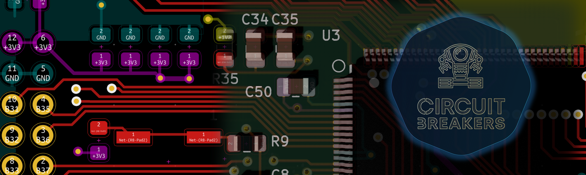
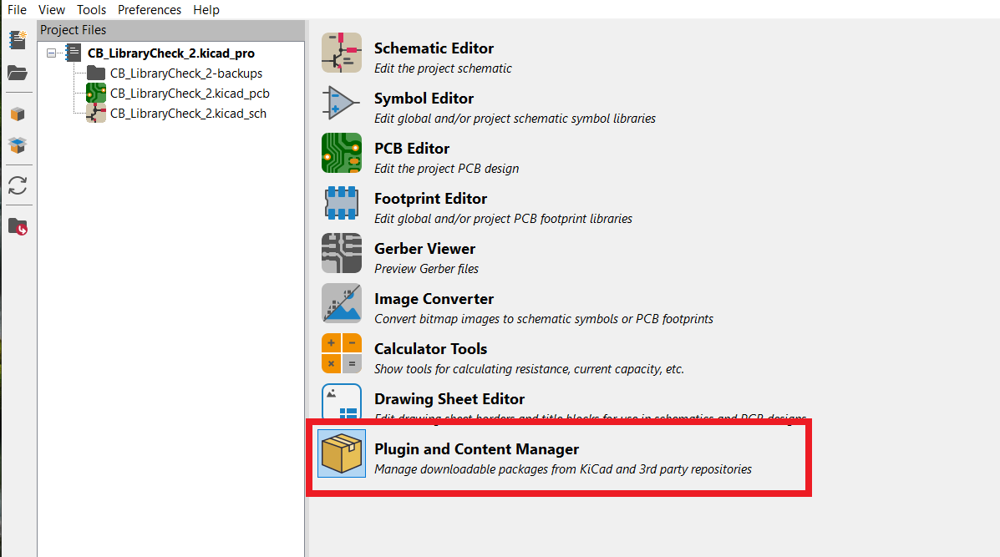
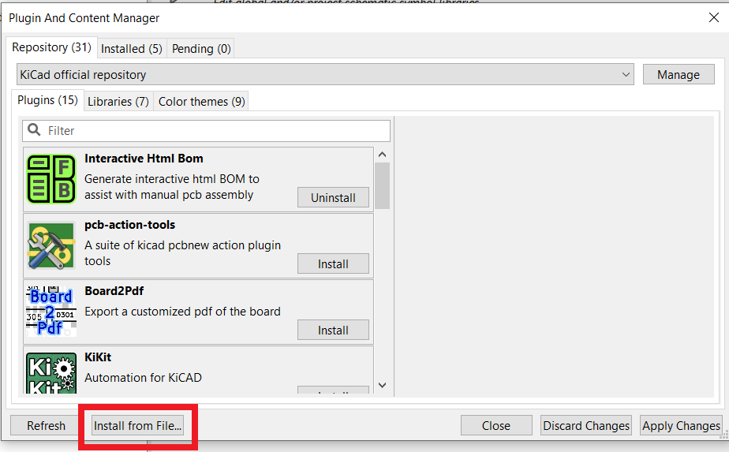
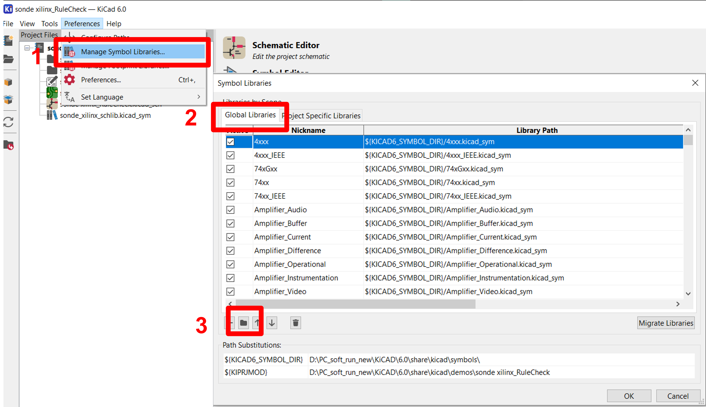
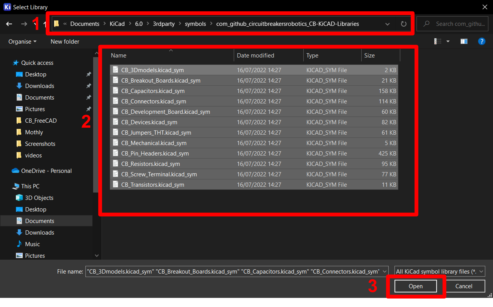
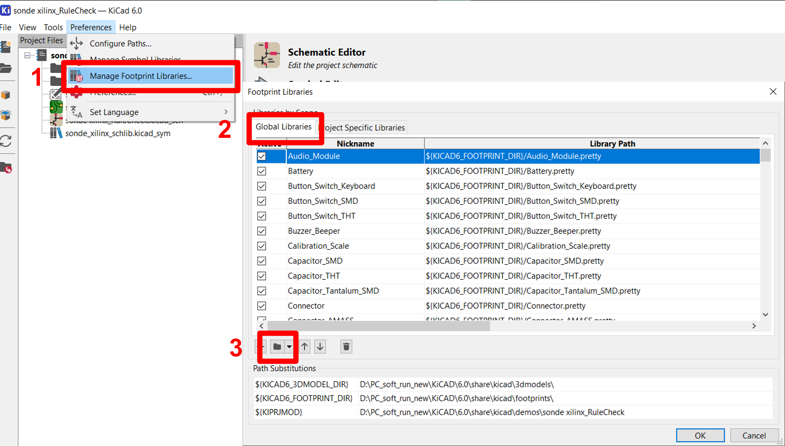
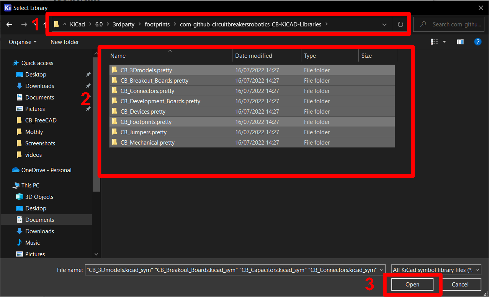
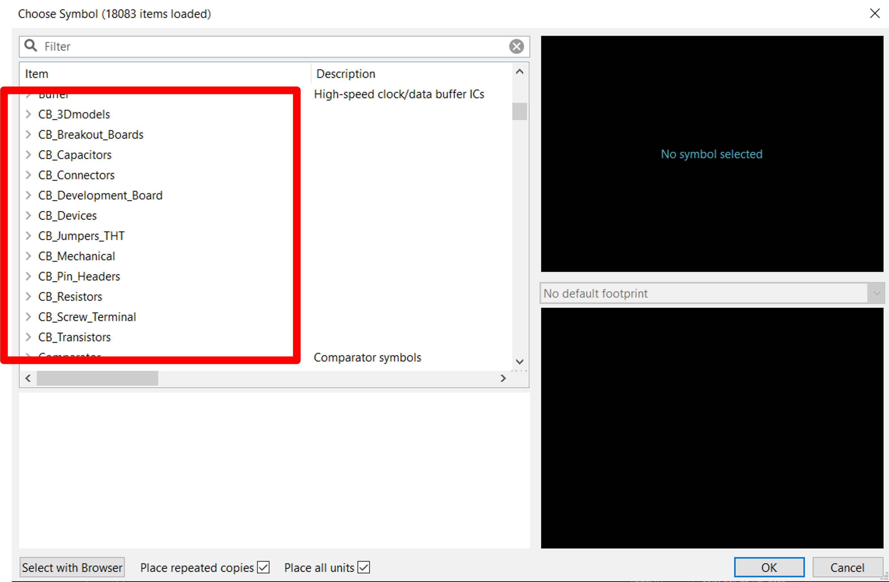
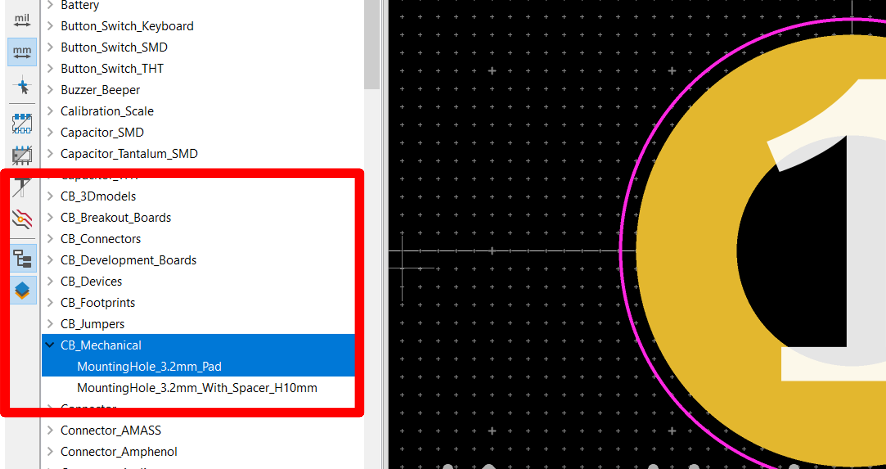
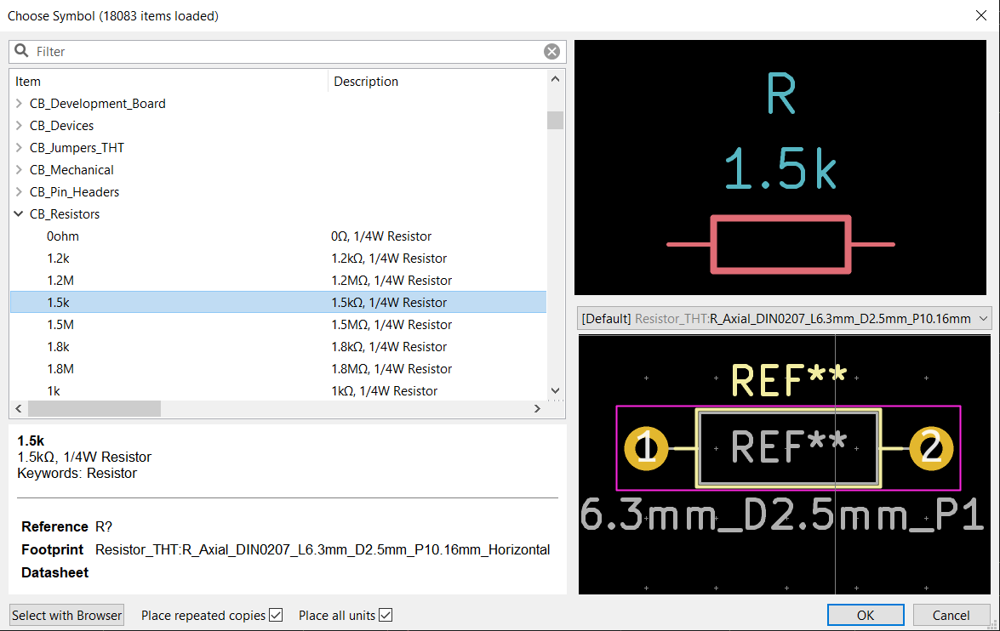

       

# **CircuitBreakers KiCAD Libraries**

##  **Introduction**
---

Circuit Breaker Robotics KiCAD library pack is a collection of common electronic components libraries for the free and open-source KiCAD PCB design software. The goal of Circuit Breaker KiCAD Libraries is to provide a user-friendly library package for beginners. Components like resistors and capacitors are name base on the values like 10k,100ohm, 22uF… So users can directly search for the value and directly add it to their design. Most of the footprints and the 3D models are directly linked to KiCAD’s default libraries. So users can still use KiCAD,s official footprints, and 3D models.  

## **Requirements**
---
- You need to have a KiCAD version 6 or above. If not, install the latest KiCAD version from <a href="https://www.kicad.org/download/">here</a>.

- Required to have default(official) KiCAD libraries installed in KiCAD. Because some symbols in CB KiCAD Libraries are linked to KiCAD default libraries.

- Need to have 200MB of disk space.

## **How to install 📜**
---

The CB KiCAD libraries can be installed through **📦 PCM(Pluging and Content Manager)** in KiCAD manually.

1. First you need to download the latest release vision of the library pack. Click below to download the latest release vision.

    ### **+------------------------------------------------------------------------+**
     ##         **📂Download -> <a href="https://github.com/circuitbreakersrobotics/CB_KiCAD_Libraries/releases/download/v0.0.4/CB_KiCAD_Libraries_v0.1.zip">CB_KiCAD_Libraries_v0.1</a>**
    ### **+------------------------------------------------------------------------+**

   

2. After downloading the package, open KiCAD and launch the PCM.

      

3. Click on the option "Install from File" and select the downloaded zip file. Then the library files will be extracted into the KiCAD third-party library directories. 

      

   

4. After successfully installing the libraries we need to manually update symbol and footprint library tables. To do that go to **preference > 📚manage symbol libraries** and select the **global library** section. Then click the file icon at the bottom and navigate to the following location according to your operating system.

       

**Windows ->** 

|__`📄Documents > KiCad > 6.0 > 3rdparty > symbols > com_github_circuitbreakersrobotics_CB-KiCAD-Libraries`__ |  

    
5. Then select all the symbols libraries in that directory and click **open**. After adding the symbol files to the library table click **OK** to close the symbol library manage window.

     

6. To add footprint libraries go to **preference > 📚manage footprint libraries** and select the **global library** section. Then click the file icon at the bottom and navigate to the following location according to your operating system. 

      

 **Windows ->** 

 | __`📄Documents > KiCad > 6.0 > 3rdparty > footprints > com_github_circuitbreakersrobotics_CB-KiCAD-Libraries`__ |

 

7. Then select all the footprint folders in that directory and click **Select Floder** . After adding the footprint folders to the library table click **OK** to close the footprintl library manage window.

      

To check whether all the symbol libraries are installed correctly, open the schematic editor and go to Add Symbole command. Then scroll through the list of libraries and see whether the following libraries are in the list. 

- CB_3Dmodels
- CB_Breakout_Boards
- CB_Capacitors
- CB_Connectors
- CB_DevelopmentBoards
- CB_Devices
- CB_Jumpers_THT
- CB_Mechanical
- CB_PinHeaders
- CB_Resistors
- CB_Transistors

 

To check whether all the footprint libraries are installed correctly. Go to the Footprint Editor and find similar libraries to symbol library names in the Library panel as shown in the following image. 

 

If all the libraries are installed correctly you can browse through the components in the Circuit breakers KiCAD libraries. To learn about the components in the CB KiCAD Library pack see what’s in this library section. 

##  **What’s in this library pack?**
---

KiCAD Library pack was created to make the adding components to the project easy. This library pack contains value-based component libraries. For example, if you need to add a 10k resistor to the schematic just type 10k on the search bar and you will get a 10k resistor with the value on it.  Just like that, we can search for common capacitors and crystal oscillators based on their values. When selecting footprints to the symbol only the commonly used packages are filtered. Which makes the footprint selection process easy. If you cannot find the value or footprint you are looking for, You add the common component symbol from the default KiCAD libraries and change the value and the footprint accordingly. 

 

CB KiCAD libraries contain symbols for some common connectors like Pinheaders male and female,  JST connectors, and Terminal Block connectors. This allows the user to search the name directly and get the symbol and the footprint need for the project. 

CB KiCAD also contains some development board and breakout board libraries with 3D models for some of the packages.  

All the components in theCB  KiCAD Library are listaed below. 

 <table>
   <thead>
    <tr>
     <th colspan="3" rowspan="1"><b>CB KiCAD Library List</b></th>
    </tr>
   </thead>
   <tbody>
    <tr>
     <td><strong>CB_Devices</strong></td>
     <td>
     <ul>
       <li>
Buzzer_5v
</li>
       <li>
Crystal_8MHz - 24MHz
</li>
       <li>
Crystal 32.768kHz
</li>
       <li>
IC DIP Package 8,14,16
</li>
       <li>
LED 5mm, 3mm, 8mm, 10mm
</li>
        <li>
Push Button
</li>
       <li>
Potentiometer RM065, 3362P, RK163
</li>
       <li>
Resistor 0.5W, 1W, 5W, 10W
</li>
       
  

    </tr>
    <tr>
     <td><strong>CB_Capacitors</strong></td>
     <td>
     <ul>
       <li>
1uF to 4700uF
</li>
    </tr>
    <tr>
     <td><strong>CB_Resistors</strong></td>
     <td>
     <ul>
       <li>
0 ohm to 10M
</li>
    </tr>
    <tr>
     <td><strong>CB_Transistors</strong></td>
     <td>
     <ul>
       <li>
BC108
</li>
       <li>
C828
</li>
       <li>
D313
</li>
       <li>
D400 🆕
</li>
    </tr>
    <tr>
     <td><strong>CB_Connectors</strong></td>
     <td>
     <ul>
       <li>
JST Pin 02 -10
</li>
       <li>
Servo Ports pin 01 - 08
</li>
    </tr>
    <tr>
    <td><strong>CB_PinHeaders</strong></td>
     <td>
     <ul>
       <li>
Pinheaders Male 1x1 - 1x20
</li>
       <li>
Pinheaders Female 1x1 - 1x20
</li>
       <li>
Pinheaders Male 2x1 - 1x5
</li>
       <li>
Pinheaders Female 2x1 - 1x5
</li>
    </tr>
    <tr>
    <td><strong>CB_Screw_Terminal</strong></td>
     <td>
     <ul>
       <li>
Screw Terminal P5.00mm Pin  2 - 9
</li>
       <li>
Screw Terminal P3.5mm Pin  2 - 9
</li>
    </tr>
    <tr>
    <td><strong>CB_Jumpers_THT</strong></td>
     <td>
     <ul>
       <li>
Jumpers from 10mm - 120mm
</li>
    </tr>
    <tr>
     <td><strong>CB_DevelopmentBoards</strong></td>
     <td>
     <ul>
       <li>
Arduino Pro Mini
</li>
       <li>
ESP32 CAM
</li>
       <li>
ESP32 DevKit V1 DOIT 30GPIOs 🆕
</li>
       <li>
ESP32 DevKit V1 DOIT 32GPIOs 🆕
</li>
       <li>
Lolin NodeMCU ESP8266 V3
</li>
       <li>
Rasberry Pi Pico
</li>
       <li>
Blue Pill DevBoard
</li>   
    </tr>
    <tr>
         <td><strong>CB_Breakout_Boards</strong></td>
     <td>
     <ul>
       <li>
A4988
</li>
       <li>
HC-05 Bluetooth Module🆕
</li>
       <li>
HC-06 Bluetooth Module
</li>
       <li>
HC SR04 Ultrasonic Sensor
</li>
       <li>
LCD 16x4
</li>
       <li>
MPU6050🆕
</li>
       <li>
PIR Sensor
</li>
    </tr>
     </tbody>
  </table>

